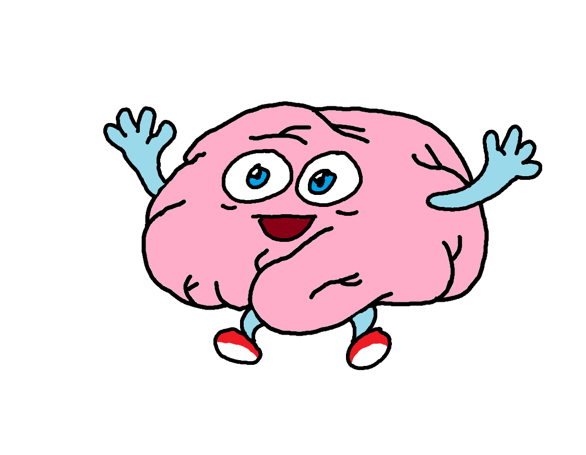

:::: {style="display: flex; align-items: center; gap: 2rem;"}

::::

I host a weekly stats club at my university for graduate students and faculty to talk anything data or stats related! I am passionate about stats education and I think being excited about learning is empowering! Check out **Stats Snack** [here](https://candicekoolhaas.github.io/stats-snack/)!

I also host a weekly in-person meeting with research assistants in my lab where I introduce them to data analysis using R. When I'm on top of things, I post the homeworks and other resources [here](https://github.com/candicekoolhaas/Kool_R_club)!

I am also interested in cognitive improvement - check out my [blog](https://n-ov-one.blogspot.com/)!

I have a super nerdy [Youtube channel](https://www.youtube.com/@WorkingMemoryWizard) where I plan to make for-fun videos summarizing concepts in cognitive psychology that really interest me. So far I have one video... hopefully more to come!

In general, free public education is something I love to contribute to! Some workshops I've been apart of include this ManyBabies workshop on [getting started with datapages](https://youtu.be/HT2rtEAHQac?si=lRUdxAv771LX8Yfg), this [Development in Context webinar](https://youtu.be/c31Vk-6fdIk?si=ZrxSwSjm_srnVwDC), and the talks I've hosted from invited speakers at Stats Snack can be found [in this folder](https://drive.google.com/drive/folders/16zZn2QL_hwQpdlpKfZJrg54xbP5C_a8s?usp=drive_link)!\
\
(And all of these funny brain doodles are hand drawn by me on MS paint!)
