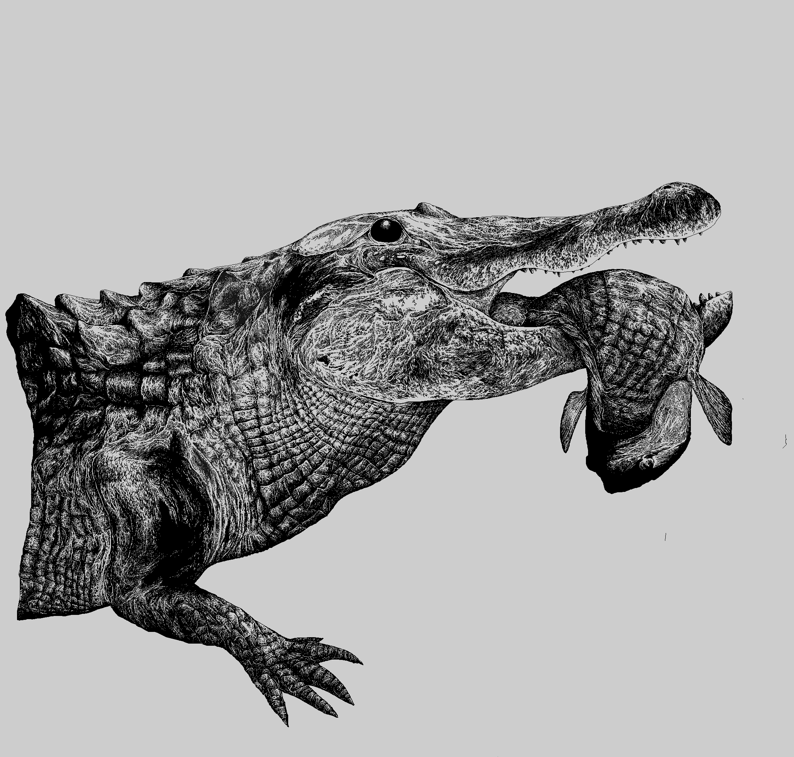

My friend and colleague, Dr. Jamie Donenfeld, is an incredible nature photographer. I was inspired by her photography of Florida wildlife (particularly considering I grew up in Florida and adore alligators) and drew one of her photographs of a gator with a fish. I hope to link to her photography here one day, when she makes it available online 🙂I also hope to post more art here (when I finish some more drawings...)
